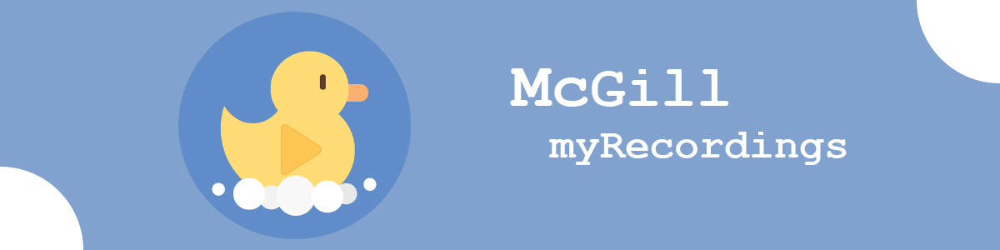
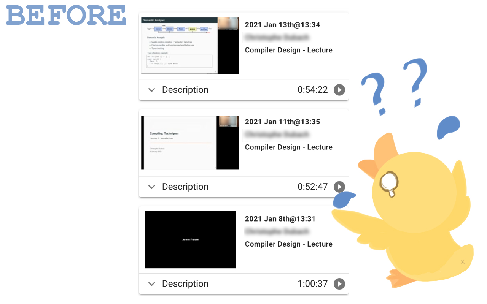
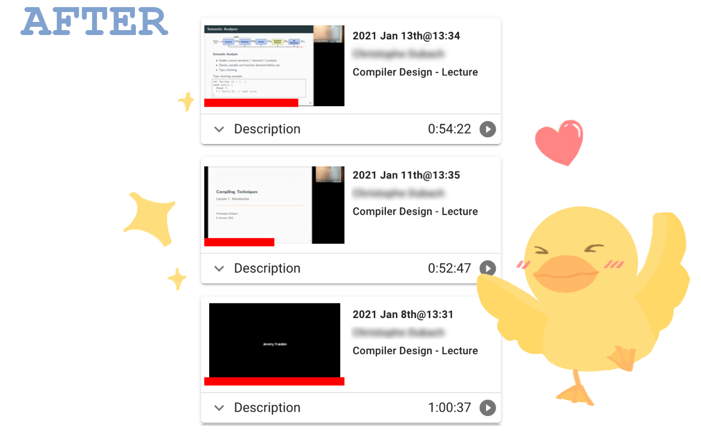

<!--
Template taken from
https://github.com/othneildrew/Best-README-Template/blob/master/README.md
-->
<!-- PROJECT LOGO -->

<br />
<p align="center">
  <a href="https://github.com/Deerhound579/my-recordings/images/logo.png">
    
  </a>

  <h1 align="center">My Recordings</h1>

  <p align="center">
    The missing features of McGill's LRS
    <br />
    <br />
    <a href="https://github.com/Deerhound579/my-recordings/issues">Report Bug</a>
    ·
    <a href="https://github.com/Deerhound579/my-recordings/issues">Request Feature</a>
  </p>
</p>

<!-- TABLE OF CONTENTS -->
<details open="open">
  <summary>Table of Contents</summary>
  <ol>
    <li>
      <a href="#about-the-project">About The Project</a>
    </li>
    <li>
      <a href="#getting-started">Getting Started</a>
    </li>
    <li><a href="#contributing">Contributing</a></li>
    <li><a href="#license">License</a></li>
    <li><a href="#acknowledgements">Acknowledgements</a></li>
  </ol>
</details>

<!-- ABOUT THE PROJECT -->

## About The Project



In the period of online learning, we rely heavily on lecture recordings. The
current LRS doesn't remember our viewing history, and of course, we can't resume
from where we left off. Our course load is already heavy, we need an easy way to
manage our recordings.

This tool remembers you viewing history with a progress bar under each video.
And you can resume from where you left.

Never fear for refreshing the page by accident again.

 

<!-- Reminder -->

## Note

The update happens every second, so it's not 100% accurate.
These may be improved in the future.

<!-- GETTING STARTED -->

## Getting Started

Download it in [Chrome Web Store](https://chrome.google.com/webstore/detail/my-recordings/jbgkkonlpjfngadnpglnkcahkjnmffdf)

<!-- CONTRIBUTING -->

## Contributing

### Local development

- Clone the repo

```
git clone https://github.com/Deerhound579/my-recordings.git
```

- Go to [Chrome extension](chrome://extensions/) page. Click `Load unpacked` and
  load the project folder

- Make your changes and reload the extension. For more information, see
  [the official guide](https://developer.chrome.com/docs/extensions/mv2/getstarted/)

<!-- LICENSE -->

## License

Copyright © 2021 Sixian Li.

McGill is a University in Montreal and has no affiliation with this software.

This software is distributed under the MIT License. See `LICENSE` for more
information.

## Acknowledgements

All illustrations are created by Mory(
[@m0ry_hit0mi](https://www.instagram.com/m0ry_hit0mi/?r=nametag))
